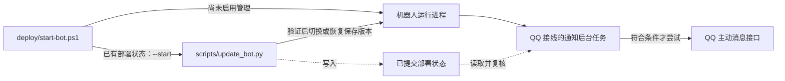

# Windows 自动更新

适用于本仓库的单实例 Windows 部署，跟随 `doublequiet-on/taki-ournotes-bot` 的 `main` 分支。伙伴先提交分支 / PR，审阅并合并到 main 后，程序每五分钟检查一次。更新检查不调用 AI 或 X API。

## 阅读入口与协作流程

本页负责启用、暂停、启动和故障排查。首次安装与凭据准备见 [README](README.md#快速开始) 和 [LOCAL_QQ_TEST](LOCAL_QQ_TEST.md)。本地启动分流及准备工具见 [Deploy L2](deploy/L2.md)，脚本的调用路径、部署状态字段与恢复契约见 [Scripts L2](scripts/L2.md#部署状态协议)，运行时公告的触发、去重与许可边界见 [更新通知机制](docs/更新通知机制.md)。



图中的虚线表示共享文件协议，不是 Python 导入。事务尚未结束、版本身份不符或部署状态被拒绝时，通知任务不发送公告。

## 首次启用

先完成 [README 的本地安装](README.md#快速开始)，安装 Git 并保证它在 PATH 中。准备脚本的完成提示不能单独证明同步成功，需核对实际结果，边界见 [Deploy](deploy/L2.md#failure--degradation-boundaries)。本地须在 main 分支、没有未提交改动，origin 指向本仓库。将所需修改提交并推送，等对应提交的 GitHub Checks 通过。以下命令均在项目根目录执行：

```powershell
.\.venv\Scripts\python.exe -B -X utf8 scripts\update_bot.py --initialize
powershell -NoProfile -ExecutionPolicy Bypass -File scripts\install-update-task.ps1
```

初始化会进行一次受控重启。任务名为 `Taki-OurNotes-AutoUpdate`，当前用户登录后运行，每五分钟检查，无需管理员权限，不弹出窗口。电脑关机、休眠或用户注销期间不能工作；重新登录后继续。任务安装不等于每次检查一定成功，应查看状态。

另有 `Taki-OurNotes-Runtime` 任务专门运行机器人，由更新器启动，无独立定时触发。两者分开，避免长时间运行的机器人占住更新任务，或被更新任务的超时限制关闭。运行任务没有时长上限。

安装程序将 Git 的位置保存在本机 `data/updater/settings.json`，后台检查不依赖终端的 PATH。以后移动或重新安装 Git，需重新运行任务安装脚本更新位置；找不到 Git 时暂停，不关闭当前机器人。

## 日常操作

```powershell
# 查看最近一次检查结果（不是实时 QQ 收发诊断）
.\.venv\Scripts\python.exe -X utf8 scripts\update_bot.py --status
# 立即检查并按条件更新
.\.venv\Scripts\python.exe -X utf8 scripts\update_bot.py --once
# 只检查远端和 CI，不切换、不启动机器人
.\.venv\Scripts\python.exe -X utf8 scripts\update_bot.py --check
# 排除网络或安装问题后，重试已暂停的问题版本
.\.venv\Scripts\python.exe -X utf8 scripts\update_bot.py --once --retry
# 暂停自动检查；不会关闭当前机器人
powershell -NoProfile -ExecutionPolicy Bypass -File scripts\install-update-task.ps1 -Disable
```

恢复定时检查：重新运行不带 `-Disable` 的安装命令。需要长期关闭机器人时，先暂停任务，否则下次检查会重新启动已保存的版本。启用管理后用 `deploy/start-bot.ps1` 启动，它会避免重复实例；不要另外直接运行 `ournotes-bot bot`。

暂停自动检查后，关闭机器人可执行 `Stop-ScheduledTask -TaskName Taki-OurNotes-Runtime`；启动仍使用 `deploy/start-bot.ps1`。

`--status` 读取最近记录，不能证明当前 QQ 在线；构造更新器时仍可能创建本地目录。`--check` 会取得锁、校验工作树，并可能 fetch、写状态和日志，但不启动、切换或恢复机器人。`--start` 处理保存的活动版本，不检查远端新版本；如有未完成事务，先校验工作树，再在恢复过程中校验版本路径与实例归属。当前工作树有未提交改动时，这些保护会暂停相应操作，不能用启动命令绕过。

## 更新流程与边界

- 只处理 main 的快进更新，不自动合并冲突，不 reset、不 stash。本地有修改就暂停，保留当前机器人。工作树保护先于未完成事务恢复；`--check` 遇到事务只报告暂停。
- 检查目标提交对应的最新 Checks 运行，必须包含 Python 3.10 和 3.12 的成功任务。等待、失败、无记录、网络异常都不会部署。
- 在 `data/updater/releases` 建立代码快照和独立虚拟环境，安装依赖，执行离线测试与帮助命令。验证环境不传入 QQ、AI 凭据或私人缓存配置。它不是恶意代码安全沙箱：请仅合并可信贡献者的代码，审核依赖。
- 验证通过才停止旧实例、启动候选版本。确认 QQ 网关上线且进程仍存活后，才快进本地源码并记录成功。上线不能证明真实查询、图片上传或群消息发送全部正常；测试不会向群发消息。
- 启动失败会恢复上一运行版本，并暂停自动重试该提交。新的提交可继续更新；同一提交修复了环境问题后使用 `--retry`。恢复也失败时保留事务文件供下次检查恢复，不伪报在线。
- `.env`、缓存、AI 日额度始终共用项目根目录的数据，不因回退恢复旧值。上个版本须能读新版本写入的数据；涉及不兼容数据迁移时先暂停自动更新并人工处理。
- 检查 / 更新共用文件锁，任务也禁止重叠运行。只停止本项目识别到的 Taki 进程，不停止旁边的推文翻译机器人。无法确认或发现多个实例时暂停。
- `data/updater/status.json` 是最新检查结果，`updater.log` 是脱敏更新日志，`runtime-*.log` 是机器人本机日志。不要将 data 文件夹公开。保留版本快照供回退会占用磁盘，不自动删除；空间不足时暂停，确认活动版本和上一版本后再人工清理其他版本。
- 若切换末尾意外中断，运行版本可能暂时与工作区 HEAD 不同；事务恢复优先保持可运行版本，不倒退 Git 历史。不要手动删除 state / transaction 文件来“修复”。

字段所有者、版本路径校验、成功提交与恢复写入顺序由 [Scripts 的部署状态协议](scripts/L2.md#部署状态协议) 统一说明。状态文件各自原子替换，不代表 Git、状态和事务文件能一起原子提交。

普通 Git 提交不会自动推送；本程序只下载和部署，不替你审批 PR 或合并远端分支。GitHub Actions 的免费额度和网络要求仍按你的账户情况执行。

## 更新后的群通知

候选版本通过检查、QQ 网关就绪、更新器保存 active 版本并结束切换事务后，机器人后台任务才具备公告触发条件。它读取公开提交标题、变动文件和 `更新日志.md` 新增内容，通过现有 `AI_API_KEY`、`AI_BASE_URL`、`AI_MODEL` 配置生成面向群友的简短公告。请在更新日志中准确写明群友可感知的变化；模型只收到公开仓库变更资料，不收到密钥、群号或聊天记录。程序合并空白并检查 120 字上限和内部术语；提示词要求简短、跳过仅内部维护的变化，但程序不能保证模型的事实判断或句数。后台任务每轮处理后等待 30 秒，生成和多群限速处理还会增加耗时，因此不保证切换后 30 秒内送达。

群标识从机器人实际收到的群消息与入群事件中取得，退出群聊和主动消息开关事件会同步保存。首次启用前未被记录的群，需要先在该群 @Taki 一次；普通群消息也能帮助识别群，但前提是群已允许机器人接收这种事件。程序只保存群标识和通知状态，不保存聊天正文。

发送前尽量读取官方 `bot_state` 中的 `allow_proactive_msg`。该查询接口需要白名单权限；不可用时保留已知开关状态，对未确认状态的群使用官方主动消息接口，由 QQ 校验发送权限。不会借用历史 `msg_id` 或 `event_id` 伪装被动回复。明确关闭或已退群的群会跳过；QQ 拒绝发送、限流和网络异常只记录结果，不影响查询功能。

生成报告和发送记录位于游戏缓存旁的 `update-notices.sqlite3`。报告按 AppID 和提交 SHA 共用，生成前先持久化占位，避免重启后重复调用付费 API。缺少 AI 客户端时不生成新报告；同一版本已经保存的有效报告仍可复用。生成失败、空报告或生成中断不自动重试，也不借用其他版本的公告。发送按 AppID、群和提交 SHA 去重：先持久化占位，再调用 QQ；收到有效消息 ID 才记为成功。失败、无有效回执和发送中断均不自动重发；明确禁用的尝试也会留下记录。这意味着异常时可能漏掉当次公告；下一次新版本仍可正常尝试。不要删除数据库来补发公告，更新器的 `--retry` 也不会重置公告账本。

普通重启和重复检查不清除已有发送记录；部署失败和回退也不清除。当前版本首次被记录的新群若尚无该版本记录，仍可能进入待通知集合，不能把去重理解为整个版本永远只运行一次。具体触发复核、账本状态和失败窗口见 [更新通知机制](docs/更新通知机制.md)。

群记录与发送记录沿用共享数据目录，部署、回退不会覆盖。读取或写入失败时暂停通知，查询服务继续工作。`OURNOTES_UPDATE_NOTICES=0` 可全局关闭，默认开启。未经过现有自动更新器的启动，不会仅因启动而广播；更新报告调用是独立于群友查询额度的一次付费 API 请求。

项目已有接口参考：[官方消息收发与主动消息规则](https://bot.q.qq.com/wiki/develop/api-v2/server-inter/message/overview.html)、[机器人群内状态](https://bot.q.qq.com/wiki/develop/api-v2/autogen/api/v2_groups_group_openid_bot_state.get.html)。平台额度、白名单与实际许可需在运维时另行确认。

## 常见问题与排查

| 现象 | 优先检查 | 操作边界 |
|---|---|---|
| 任务已安装但没有更新 | 最近检查时间、main、干净工作树、预期 origin、Git 位置及最新 CI | 任务安装不保证更新成功；等待或失败的 CI 阻止部署，不自动改远端或允许任意 fork |
| 状态显示成功，但查询或发图失败 | 状态时间、运行任务及本机运行日志 | 就绪信号只证明网关上线和进程短时存活，不能代替实际功能诊断 |
| 更新、启动或事务恢复暂停 | main 分支、未提交改动、origin、实例数量及最新状态 | 保留本地修改；不要 reset、stash 或删除事务来强行继续 |
| 有事务，`--check` 一直暂停 | 状态和事务对应版本，先排除工作树与实例问题 | `--check` 不恢复；环境符合要求后由 `--start` 或正常检查路径处理，不手改状态 |
| 候选版本被拒绝 | 最新 CI、验证或启动失败记录，以及活动版本是否仍在运行 | 修复环境后可用 `--once --retry` 重试部署；恢复失败时先保留事务证据 |
| 没有群公告或只有部分群收到 | 全局开关、版本身份、AI 配置、群记录和许可、通知错误日志 | 没有 AI 客户端只阻止新生成；已保存报告可复用。失败、无回执和禁用记录不自动补发，勿删除数据库 |
| 移动 Git 后公告或检查失败 | `data/updater/settings.json` 中 Git 路径与任务状态 | 确认新位置后重新安装任务以更新配置；不要把重新安装视为当前机器人在线证明 |
| 暂停定时任务后机器人还在运行 | 更新任务和运行任务是否分开暂停 | `-Disable` 只暂停更新任务；需要停止机器人时按上方日常操作处理 |
| 快照占用空间或状态与 HEAD 不一致 | 活动版本、上一版本、未完成事务及磁盘空间 | 不自动清理，不回退 Git；确认依赖版本后再另行安排人工清理 |
